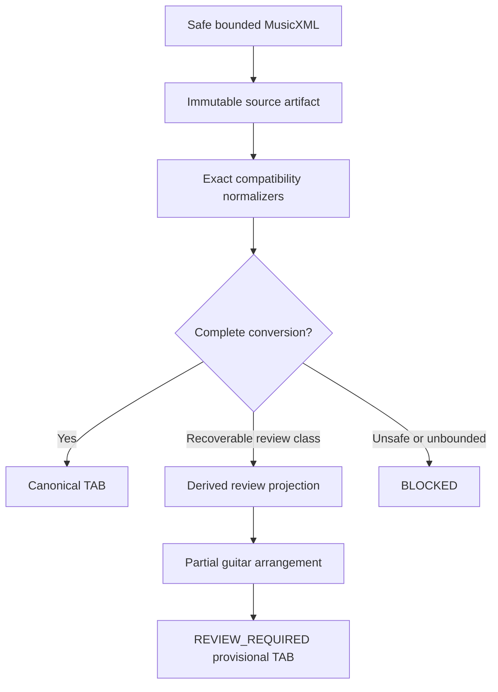

# R3 Review Projection Continuation

Status: implemented and verified locally against the pinned eleven-file Stage 09 corpus.

## Outcome

R3 extends the review-only TAB path across bounded representation and recovery cases that previously stopped safe, parseable MusicXML before a usable guitar artifact was produced. It does not turn uncertain output into canonical truth: every recovered result remains `REVIEW_REQUIRED`, provisional and non-exportable.

The pinned AnimeTAB corpus at commit `18c0993cbe0a0948cbf0b7768bcb09ff81c23a9a` now produces:

| Metric | R2 | R3 local verification |
|---|---:|---:|
| Source-renderable files | 9/11 | 11/11 |
| Files with a TAB artifact | 3/11 | 11/11 |
| Hard-blocked files | 2/11 | 0/11 |
| Assigned/source notes | 1,267/2,090 | 2,794/6,631 |
| Aggregate automatic coverage | 60.62% on recovered subset | 42.13% over all 11 files |
| Explicit unassigned notes | 823 on recovered subset | 3,837 |
| Teacher-editable files in Workbench | 0/11 | 0/11 |

The lower aggregate assignment percentage is intentional: R3 measures all eleven scores and retains difficult notes as explicit review work instead of hiding them behind a file-level block.

## Admitted bounded review projections

R3 adds source-immutable, deterministic handling for these exact classes:

- ordinary bounded display words and standard dynamic marks;
- exact segno/coda/navigation sound markers, rendered as an explicitly reviewed single pass rather than executing an unverified jump;
- noncanonical `times` metadata attached to a forward repeat, retained as review evidence while using the structurally valid traversal;
- incomplete or ambiguous repeat endings, rendered as an explicitly reviewed single pass;
- exact measure event overflow where a positive remaining duration can be proven, using a derived duration clamp only in the review projection;
- cursor overflow introduced by that derived clamp, within the fixed repair bound;
- invalid tie chains in a provisional reduction, with tie flags omitted from the derived TAB and recorded for review;
- dense/unplayable physical selections, reduced deterministically to a sparse melody-oriented result;
- extracted grace events, retained explicitly as `UNASSIGNED` review work.

The original source bytes and source artifact are never rewritten. Each approximation is identified in review issues; no R3 result with these issues receives export or canonical authority.

## Runtime path

The review projection is not a correction revision. A teacher-approved edit must still create a separate revision and be independently revalidated before canonical export.

## Preserved hard boundaries

R3 still blocks unsafe/unparseable XML, entity/DOCTYPE input, invalid scalar data, unbounded structures, unsupported semantic mixtures and recovery cases where no positive bounded timing projection can be proven. It does not raise solver ceilings, change canonical ranking, infer voice splits, execute ambiguous navigation, or fabricate string/fret positions.

An extreme synthetic overflow test remains source-reviewable without claiming a TAB artifact. This is a deliberate proof that the fallback has a boundary rather than an “accept everything” switch.

## Remaining product gate

The upload result exposes provisional TAB and approximate playback, but the Guitar TAB Workbench pitch-edit endpoints are still PASS-only. The Stage 06 review-editor session contract exists and is tested; it is not yet connected to the Workbench's partial-arrangement source identities and regeneration path. Therefore the Stage 09 usable-output gate correctly remains `FAIL_USABLE_OUTPUT_GATE` solely for `TEACHER_EDITABLE_FILES_0_OF_11`.

The next implementation stage must connect selection, pitch/rhythm/voice patching, immutable revision history and revalidation for `REVIEW_REQUIRED` results. Merely setting `editPitch: true` would be a false capability claim and is prohibited.
