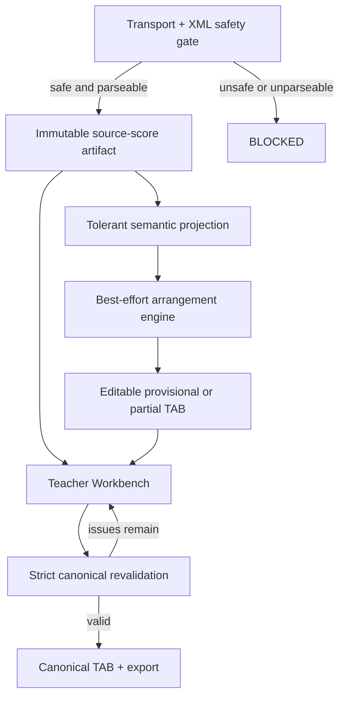

# TAB Product Recovery Architecture

<!-- ARCHITECTURE-SNAPSHOT: 2026-09-12 -->

Status: proposed implementation authority for usable-output recovery, based on main `963274a5425488b07df153460409e491f56c423d` and a fresh `2026-09-12` runtime/corpus verification.

## 1. Executive conclusion

The application is currently a strong deterministic **fail-closed validator**, but it is not yet a reliable **MusicXML-to-editable-TAB product**. Work completed through PA-8, PA-9, PA-10.5, PA-11.4A and PA-12 protects source identity, bounded execution and canonical correctness. Those are valuable foundations; they do not by themselves satisfy the user outcome.

The decisive defect is architectural: source acceptance, source rendering, provisional arrangement and canonical certification are coupled to one strict pipeline. If that pipeline encounters an unsupported MusicXML feature, an arrangement it cannot express, or a bounded search ceiling before final selection, the runtime returns no source-score artifact and no TAB artifact. Some later wrappers change `BLOCKED` to `REVIEW_REQUIRED`, but still set both artifacts to `null`. The review screen therefore has nothing to display or edit.

The recovery program must preserve the existing strict canonical path while adding a tolerant product path. Every safe, parseable and resource-bounded MusicXML upload should open in the teacher workspace. It should produce the best available `PROVISIONAL` or `PARTIAL` TAB, explicitly marking omissions, octave moves, reductions, revoicings, arpeggiations and unassigned notes. Incorrect musical choices are review data, not reasons to erase the result.

“Every XML” cannot safely include malformed XML, entity-expansion attacks, oversized transport payloads or inputs for which bounded parsing cannot produce a trustworthy source model. Those remain hard blocked. The product promise should be:

> Every safe, parseable, resource-bounded MusicXML score opens for review; every recoverable pitched passage receives an editable best-effort guitar arrangement; only validated or teacher-approved output is canonical/exportable.

## 2. Verified evidence

Verification was run from a clean dependency install against the current main revision, not inferred from historical closeout documents.

| Evidence | Observed result | Product meaning |
|---|---|---|
| Full Node test suite | 1,553 passed; 0 failed | Existing deterministic and security contracts are healthy. |
| Pinned Stage 09 eleven-file corpus | `0 PASS`, `6 REVIEW_REQUIRED`, `5 BLOCKED` | Current status routing is deterministic, but no file completed conversion. |
| Canonical TAB artifacts | `0 / 11` | No corpus file had an editable canonical TAB result. |
| Writer outputs | `0 / 11` | No corpus file had renderer MusicXML generated by the conversion path. |
| Live repeat case | `REVIEW_REQUIRED`; `renderScore=false`; `generateTab=false`; `provisionalTabAvailable=false` | Review classification alone does not create a usable review experience. |
| Live direction cases | `BLOCKED / UNSUPPORTED_POLYPHONIC_PROJECTION_FEATURE(direction)` | Ordinary score metadata can still stop the entire product path. |
| Live dense-score cases | `BLOCKED / LEFT_HAND_ASSIGNMENT_ATTEMPT_LIMIT_EXCEEDED` | A bounded fingering search failure discards the source and all partial work. |

The Stage 09 script can still report `PASS_VERIFIED`: `scripts/stage09-additional-real-corpus-audit.js` considers absent canonical and writer artifacts valid for a non-`PASS` status. That assertion verifies fail-closed output semantics, determinism and source immutability. It is not a usable-output acceptance test.

## 3. Root-cause map

| Root cause | Current implementation evidence | Consequence |
|---|---|---|
| One strict pipeline owns both product and certification outcomes | `src/app/musicXmlUploadRuntimeBase.js` performs normalization, projection, arrangement, physical solving, canonical construction and writing as one guarded operation. | A pre-final exception removes all usable artifacts. |
| Block construction deletes review material | `blockedResult()` returns `canonicalTabResult: null`, `musicXml: null` and unavailable source review evidence. | A safely parsed score cannot be rendered after a later capability failure. |
| Review promotion is status-only | `promoteBoundedRepeatReview()`, `promoteBoundedEndingReview()`, `promoteBoundedDirectionReview()` and `promoteUnplayablePhysicalPointReview()` in `src/app/musicXmlUploadRuntime.js` explicitly retain null artifacts. | `REVIEW_REQUIRED` can be functionally identical to `BLOCKED`. |
| Capabilities are inferred from final artifacts | `src/app/reviewRequiredCapabilityContract.js` enables rendering only from `result.musicXml` and TAB only from `result.canonicalTabResult`. | No artifact means no renderer, playback, TAB or editor capability. |
| Workbench bridge correctly refuses empty review results | `web/guitar-tab-workbench/host-controller.js` requires both backend capabilities and both artifacts. | The UI cannot compensate for the missing backend product model. |
| Compatibility is a strict allow-list | `src/parser/polyphonicMusicXmlSemanticProfile.js` and `src/app/runtimeGuitarNotationNormalizer.js` reject notation/direction shapes outside exact reviewed profiles. | Display, performance and producer metadata can unnecessarily terminate pitch-to-TAB work. |
| Arrangement decisions are almost identity-only | `buildGuitarArrangementDecisions()` emits representation `OMITTED`, `PRESERVED`, or a narrow one-octave upward displacement. | Piano textures are sent to a guitar fingering solver before musical reduction. |
| Arrangement vocabulary exceeds executable behavior | `src/music/deterministicReductionPlan.js` can execute one constrained `CHORD_REDUCED` case; `VOICE_REDISTRIBUTED` is deferred, and the plan schema's `REVOICED` / `ARPEGGIATED` intent has no autonomous production policy. | The advertised arrangement foundation is not yet a general piano arranger. |
| Canonical authorization forbids broader recovery | `assertAuthorizedGuitarArrangement()` accepts only preservation, representation omission and the exact approved octave rule. | A musically useful revoicing/reduction would currently be rejected as an unexpected change. |
| Search ceilings are terminal | PA-8 allows 20,000 generated shapes and 100,000 complete assignment attempts per group. | Dense sonorities block instead of returning a best incumbent or reduced alternative. |
| CI optimizes classification, not utility | Current corpus gates accept deterministic no-output results. | Many engineering changes can land while real TAB availability remains 0%. |

This is not mainly a renderer bug or a single bad XML bug. It is a mismatch between the strict certification architecture and the desired best-effort editing product.

## 4. Authority model

The package-root `CanonicalTabResult 1.0.0` contract and internal `CanonicalTabResult 2.0.0` path remain unchanged as certification authorities. The new product artifacts have lower authority and must be visibly labeled.

| Quality | Meaning | Editable | Playable | Exportable as approved TAB |
|---|---|---:|---:|---:|
| `CANONICAL` | Passed the existing strict validation contract | Yes | Full | Yes |
| `PROVISIONAL` | Complete best-effort note-disposition coverage; unresolved musical choices are diagnosed | Yes | Approximate/full by evidence | No |
| `PARTIAL` | At least one passage or note is unassigned/omitted after bounded recovery | Yes | Approximate | No |
| `SOURCE_ONLY` | Safe score retained, but no TAB arrangement could yet be constructed | Source yes; TAB skeleton yes | Source playback if timing is safe | No |
| `NONE` | Unsafe, unparseable or no bounded trustworthy source artifact | No | No | No |

`PASS` requires `CANONICAL`. `REVIEW_REQUIRED` may carry `PROVISIONAL`, `PARTIAL` or `SOURCE_ONLY`. `BLOCKED` may carry only `NONE`; otherwise the document is reviewable and should not be blocked.

## 5. Target working architecture



The source, provisional and canonical artifacts must be independent fields, not aliases for the final strict result:

```text
UploadResult 2.0.0
  status: PASS | REVIEW_REQUIRED | BLOCKED
  sourceArtifact: immutable source bytes + safe score graph + renderer view
  arrangementArtifact: quality + note dispositions + diagnostics + provenance
  canonicalTabResult: nullable strict authority
  capabilities: derived from each artifact independently
```

Required invariants:

1. Original bytes and parsed source facts remain immutable.
2. Unknown optional/display metadata is preserved as opaque provenance plus a diagnostic; it does not become musical authority.
3. No omitted, shifted or rewritten note is silent: every source note receives a disposition and reason.
4. A provisional choice never becomes canonical or exportable without strict revalidation or explicit teacher approval followed by revalidation.
5. Deadlines, cancellation and memory ceilings apply to every stage.
6. On timeout/search ceiling, return the best already validated incumbent plus unresolved regions when safe; do not invent a successful canonical result.
7. `BLOCKED` is reserved for unsafe/unparseable/no-trustworthy-artifact outcomes.

## 6. Tolerant MusicXML ingestion

The tolerant path does not mean silently accepting arbitrary semantics. It separates feature relevance:

| Feature class | Product-path behavior |
|---|---|
| Transport/XML safety, external entities, malformed structure, unbounded expansion | Hard block |
| Pitch/onset/duration/voice ambiguity that prevents a trustworthy local fact | Preserve source; mark affected event/region unresolved; continue elsewhere |
| Layout, font, print, credits and unknown display-only data | Preserve opaquely; warn; never block TAB pitch assignment |
| Directions, dynamics, rehearsal marks and most performance metadata | Preserve for source rendering; use when supported; otherwise diagnose and continue |
| Repeats/endings | Preserve written measure order immediately; mark playback order approximate until resolved |
| Existing TAB string/fret annotations | Treat as strong provenance/candidate constraints when valid, not as the only accepted score shape |
| Guitar techniques/ornaments | Preserve provenance; map supported semantics; expose unsupported execution details to review |

The official MusicXML model keeps rhythm in the document even when a TAB display chooses not to show it. Source semantics, TAB fingering and visual rendering should therefore remain separate artifacts rather than one all-or-nothing writer result. See the [W3C MusicXML 4.0 tablature tutorial](https://www.w3.org/2021/06/musicxml40/tutorial/tablature/).

## 7. Piano-to-guitar arrangement engine

### 7.1 What exists today

The repository has useful building blocks: simultaneous-event grouping, register-role analysis, a versioned `GuitarArrangementPlan`, guitar position enumeration, PA-8 left-hand shapes, PA-9 physical validation, sustained-note state and deterministic selection. It does **not** yet have a production policy that autonomously turns a general piano texture into a playable six-string texture.

The production upload path currently performs only:

- exact pitch preservation in register;
- omission of recognized duplicate TAB-representation notes;
- a narrow exact `+12` shift for selected notes below the register.

It does not generally decide chord-tone removal, voice redistribution, revoicing, arpeggiation, phrase-level octave displacement, melody/bass priority under conflicts, or difficulty-aware simplification. Calling the existing chain an “arrangement engine” therefore overstates current behavior; it is an arrangement foundation plus a strict fingering selector.

### 7.2 Required decision process

For each phrase and then each active sonority:

1. Build a stable musical-role analysis: melody candidates, bass candidates, inner voices, harmonic anchors, repeated tones, ties and phrase continuity.
2. Try exact preservation with current PA-7/PA-8/PA-9 validation.
3. If exact preservation is infeasible or too expensive, enter a deterministic repair ladder:
   - pitch-class-preserving octave fold;
   - duplicate-tone removal;
   - chord reduction while preferring melody, bass and characteristic harmony tones;
   - string-aware revoicing;
   - short-window arpeggiation within a declared rhythmic tolerance;
   - phrase-level inner-voice simplification;
   - explicit `UNASSIGNED` as the final partial outcome.
4. Score only already valid candidates. Use a lexicographic objective: source-note coverage, melody continuity, bass continuity, harmonic retention, timing deviation, physical playability, position/hand-motion cost and deterministic tie-break.
5. Carry the best validated incumbent across the bounded search. `FEASIBLE` is useful provisional output; `OPTIMAL` may be canonical only if every higher-level semantic contract also passes; `UNKNOWN` returns the incumbent if one exists.
6. Record per-note and per-region provenance so the teacher sees exactly what changed and can restore, move, omit or re-finger it.

### 7.3 Solver choice

The fastest recovery path is to add a bounded beam/DP solver in the current JavaScript runtime, using existing PA-7 candidate and PA-9 validation models. It avoids introducing a new service boundary while the result and editing contracts are still changing.

A later optional OR-Tools CP-SAT adapter is appropriate for offline/high-quality arrangement because the problem has integer assignment, distinct-string, reach, continuity and selection constraints. CP-SAT exposes `OPTIMAL`, `FEASIBLE`, `INFEASIBLE` and `UNKNOWN`, and supports explicit time limits, which match the incumbent-return policy. The official supported interfaces are Python, C++, Java and C#, so adopting it would add a service/worker boundary rather than a direct Node dependency. See [CP-SAT](https://developers.google.com/optimization/cp/cp_solver) and [solver time limits](https://developers.google.com/optimization/cp/cp_tasks).

### 7.4 Research interpretation

| Work | Relevant finding | Decision for this repository |
|---|---|---|
| [MIDI-to-Tab (2024)](https://arxiv.org/abs/2408.05024) | String assignment is combinatorial; both constraint-based dynamic programming and learned sequence models are credible approaches. Its guitarist study reports the transformer ahead of compared algorithms. | Use the current deterministic models for authority; later evaluate a learned reranker only on already valid candidates. |
| [A Machine Learning Approach for MIDI to Guitar Tablature Conversion](https://arxiv.org/abs/2510.10619) | Targets standard six-string TAB and explicitly includes music not originally playable on guitar, with rudimentary augmentation. | Confirms that piano conversion requires arrangement choices, not only fret assignment. Do not treat the model as production authority without reproducible data/licensing and corpus validation. |
| [Song2Guitar, ISMIR 2017](https://ismir.net/conferences/ismir-2017/) | Frames guitar arrangement as difficulty-aware reduction from polyphonic music. | Add explicit target-difficulty profiles after the basic repair ladder is usable. Its audio-input assumptions are not a direct replacement for symbolic MusicXML ingestion. |
| [DadaGP](https://github.com/dada-bots/dadaGP) | Offers a large GuitarPro-derived research corpus and representation for symbolic guitar music. | Candidate future training/evaluation source; dataset access and downstream music rights must be reviewed separately from code licensing. |
| [FretNet](https://arxiv.org/abs/2212.03023) | Addresses automatic guitar tablature transcription from audio. | Not the near-term solution for symbolic piano MusicXML-to-TAB arrangement. |

The near-term blocker is not lack of a neural model. It is the absence of a provisional artifact contract, tolerant source path, executable reduction policy and usable-output product gate.

## 8. Delivery sequence and acceptance gates

### R0 — Make CI measure the product outcome

- Add a current-runtime corpus report with `sourceRenderable`, `tabArtifactAvailable`, `tabCoverage`, `unassignedNotes`, `canonicalAvailable`, `teacherEditable` and hard-block reason.
- Fail the product gate when every valid corpus file has no usable artifact.
- Keep deterministic/security gates separate so a provisional result cannot weaken them.

Acceptance: the present eleven-file run intentionally fails the usable-output gate and still passes the existing safety/determinism gate.

### R1 — Decouple and retain source rendering

- Introduce `sourceArtifact` immediately after safe parsing.
- Render the source independently of canonical TAB writer completion.
- Change review promotion to preserve the source artifact.

Acceptance: all eleven safe corpus files open as source scores; repeat and direction cases no longer show an empty review page.

### R2 — Add tolerant projection with localized diagnostics

- Classify MusicXML features by safety and TAB relevance.
- Preserve unsupported optional metadata opaquely.
- Produce partial score facts with precise unresolved locations where local semantics are insufficient.

Acceptance: display/performance-only metadata never causes a whole-document hard block; malformed/unsafe fixtures remain blocked.

### R3 — Version a provisional arrangement result

- Add `ProvisionalTabResult 1.0.0` independently of `CanonicalTabResult 1.0.0` and `CanonicalTabResult 2.0.0`.
- Require one disposition per source note: `KEPT`, `OCTAVE_SHIFTED`, `OMITTED`, `REVOICED`, `ARPEGGIATED` or `UNASSIGNED`.
- Derive UI capabilities independently from source, provisional and canonical artifacts.

Acceptance: a partial result renders and edits without granting approved export.

### R4 — Return best bounded fingering incumbent

- Split physical search into incremental feasible candidates.
- Retain the best validated incumbent before the PA-8 20,000-shape or 100,000-assignment ceiling.
- Isolate unresolved groups instead of discarding the score.

Acceptance: current dense-score ceiling cases return provisional/partial TAB and explicit unresolved regions rather than `BLOCKED` when an incumbent or safe reduction exists.

### R5 — Implement real arrangement transforms

- Activate deterministic chord reduction, voice redistribution, revoicing and bounded arpeggiation.
- Apply the lexicographic objective and difficulty profile.
- Re-run physical validation after every transform.

Acceptance: piano fixtures with more than six simultaneous notes, wide register and hand-infeasible voicings produce reviewable arrangements with complete provenance.

### R6 — Complete the teacher loop

- Present source score and provisional TAB in one synchronized Workbench.
- Allow string/fret, octave, keep/omit, voice and timing correction according to issue scope.
- Revalidate revisions and grant canonical/export authority only after success.

Acceptance: a teacher can repair each provisional disposition and export only a validated revision.

### R7 — Broaden real-corpus release evidence

- Add piano, orchestral reduction, guitar notation, multiple producers, repeats/endings, tuplets, grace/ornaments, custom tuning/capo and pathological safety fixtures.
- Pin identities, but never branch production behavior on filename or hash.
- Report product and certification metrics separately.

Initial targets for safe, parseable corpus inputs:

| Metric | First recovery target | Release target |
|---|---:|---:|
| Source opens in Workbench | 100% | 100% |
| Provisional or better TAB artifact | >=95% | 100%, allowing explicit partial/unassigned notes |
| Unsupported display-only hard blocks | 0% | 0% |
| Note-disposition accounting | 100% | 100% |
| Canonical success | Measured, not conflated with usability | Improved by corpus class |
| Unsafe/malformed input rejection | 100% | 100% |

## 9. First implementation slice

The first code PR should be deliberately small and revealing:

1. Extend the Stage 09 audit with usable-output metrics and make the current corpus fail that new product gate.
2. Add `sourceArtifact` at the safe-parser boundary and preserve it through every reviewable result.
3. Change capability derivation so source rendering does not depend on canonical TAB completion.
4. Add one repeat fixture, one direction fixture and one PA-8 ceiling fixture proving that all three open for review without gaining export authority.

Only after this vertical slice is visible in the deployed Workbench should the broader arrangement solver be implemented. It proves the new authority separation and prevents another cycle where internal stages advance while the user-visible TAB outcome remains absent.

## 10. Non-solutions

- Raising PA-8 limits without changing the incumbent/partial-result contract only moves the failure point and can increase latency.
- Adding more filename/SHA-specific normalizers does not produce general MusicXML support.
- Relabeling `BLOCKED` as `REVIEW_REQUIRED` without artifacts does not create reviewability.
- Letting the renderer or an ML model become semantic/canonical authority would weaken the existing correctness boundary.
- Requiring perfect automatic guitar arrangement before showing anything repeats the current all-or-nothing failure mode.

The architectural fix is to make useful, explicitly imperfect output a first-class result while keeping canonical approval strict.
